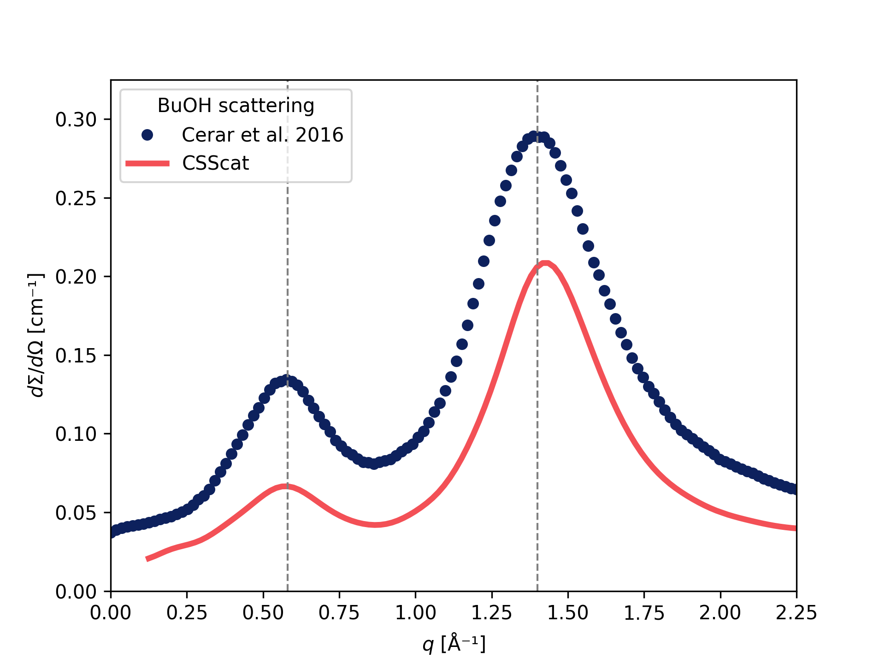

# CSScat  - Complemented System Scattering

This is a Python implementation of [Complemented System Approach](https://doi.org/10.1063/1.3502683) – a method used to calculate Small-Angle X-Ray Scattering (SAXS) from molecular simulation data. 

<p align="center">
    
</p> 

## Background 

In Complemented System Approach scattering is calculated as a sum of two terms: The first term is based on the well-known Debye equation that calculates the scattering of the simulation box – discrete systems. This is extended with an additional term representing the interference of the limited simulated system with the infinite surroundings of an electron density equal to the averaged electron density of the simulated system. Such an approximation effectively "masks" the finiteness of the system by complementing the missing surroundings of each particle with an average image of the system (hence the name):

$$
\frac{d\Sigma}{d\Omega}(q) = \frac{r_e^2}{V} \sum_{i=1}^{N} \sum_{j=1}^{N} f_i(q) f_j(q) \frac {sin(qr_{ij})} {qr_{ij}} \cdot H (r_c - r_{ij}) 
$$

$$
-\frac {r_e^2} {V^2} \left( \sum_{t=1}^{T} {f_t(q)N_t} \right)^2 \cdot \frac {4\pi} {q^3} [\sin(qr_c) - qr_c \cos(qr_c)]
$$

where $d\Sigma/d\Omega$ denotes scattering cross-section per unit volume (absolute intensity), $r_e$ the classical electron radius, $V$ the volume of simulated system, $N$ number of particles, $r_{ij}$ distance between $i$-th and $j$-th particle, $f(q)$ respective atomic form factors, $r_c$ cut-off distance (half-length of simulation box), $H$ the Heaviside step function, $T$ number of particle types, and $N_t$ number of particles of specific type. The scattering vector (momentum transfer) is defined as $q = 4\pi sin(\theta) / \lambda$, where $2\theta$ is the angle between the incident beam and the detector measuring the scattered intensity, and $\lambda$ is the wavelength of the radiation. 

For a comprehensive explanation of the complemented-system approach, refer to the literature below. These references also include studies showcasing the successful application of this method.

## Installation

You can install csscat-py using pip. First, clone the repository and then install the package:

```bash
git clone https://github.com/JureCerar/csscat-py.git
cd csscat-py
pip install .
```

> [!NOTE]
> If `pytorch` is detected during installation, a CUDA-accelerated version of the algorithm will be built automatically. See [pytorch](https://pytorch.org/get-started/locally/) documentation on how to install it. This also requires an NVIDIA GPU and up-to-date drivers. 

## Usage

You can calculate the scattering using the command-line interface:

```bash
csscat -s conf.pdb -f traj.xtc -o out.pdh
```

Use `--help` or `-h` flag to get more information on how to use it.

Alternatively, for more flexibility and integration into analysis workflows, use the Python API. This approach provides greater control over parameters and is recommended for advanced analysis or scripting. `CSScat` is implemented as an [MDAnalysis AnalysisBase](https://docs.mdanalysis.org/stable/documentation_pages/analysis/base.html) class:

```python
import MDAnalysis as mda
import csscat

# Create universe and calculate scattering 
univ = mda.Universe("topology.pdb", "trajectory.dcd")
R = csscat.CSScat(
    univ.atoms,
    binsize=0.002, # [Å]
    qmin=0.15, # [Å⁻¹]
    qmax=2.50, # [Å⁻¹]
    qpoints=251,
).run()

# Calculate mean scattering
x = R.results.qrange
y = R.results.dsdo.mean(axis=0)

# Save result to a file
R.save("out.pdh")
```

For more details on integrating with MDAnalysis, see the [AnalysisBase documentation](https://docs.mdanalysis.org/stable/documentation_pages/analysis/base.html).

### Atomic Form Factors

Atomic form factors are defined from `elements` topology attribute, and `formalcharges` (if present). If your universe does not have `elements` attribute, either assign them manually or use MDAnalysis built-in guesser:

```python
if not hasattr(u.atoms, "elements"):
    u.guess_TopologyAttrs(to_guess=["elements"])
```

A wide range of common atoms and ions (from H to Xe) are natively supported, with form factors sourced from [crystallographic tables](https://doi.org/10.1107/97809553602060000600). CSScat-py also supports pseudo-atoms, where the form factor is computed internally using the Debye equation from provided atom coordinates.

You can extend or override these definitions by adding your own atoms, pseudo-atoms, or custom form factor expressions. This is done by modifying (or creating a local copy) the form factor dictionary, for example:

```python
from csscat import formfactors
from csscat.formfactor import Atom, Pseudo, Custom

# Add a new atom with custom parameters
formfactors.add_atom("H", a=[0.493, 0.323, 0.142, 0.041],
                     b=[10.51, 26.13, 3.14, 57.80], c=0.003038)
# Or via direct assignment
formfactors["H"] = Atom(...)

# Add a new pseudo-atom composed of other atoms
formfactors.add_pseudo("CH", elements=["C", "H"], 
                       coords=[[0, 0, 0], [1.05, 0, 0]])
formfactors["CH"] = Pseudo(...)

# Add a new custom atom with a user-defined form factor function
formfactors.add_custom("X", expr=lambda q: q ** -2)
formfactors["X"] = Custom(...)
```

The `formfactors` object behaves like a standard Python dictionary, with exception that only valid data types are `Atom`, `Pseudo`, and `Custom`. If you create custom dictionary it can be passed to the `CSScat` class via the `form_dict` argument:

```python
custom = csscat.formfactors.copy()
R = csscat.CSScat(u.atoms, form_dict=custom).run()
```

This allows you to tailor the atomic form factor definitions to your specific system requirements.

## Literature

If you are using CSScat-py please cite the following: 

```bibtex
@article{Lajovic2010,
    title = {The complemented system approach: A novel method for calculating the x-ray scattering from computer simulations},
    author = {Andrej Lajovic and Matija Tomšič and Andrej Jamnik},
    journal = {The Journal of Chemical Physics},
    volume = {133},
    number = {17},
    pages = {174123},
    year = {2010},
    issn = {0021-9606},
    doi = {10.1063/1.3502683}
}
@article{Cerar2020,
    title = {Structural, rheological and dynamic aspects of hydrogen-bonding molecular liquids: Aqueous solutions of hydrotropic tert-butyl alcohol},
    author = {Jure Cerar and Andrej Jamnik and Ildikó Pethes and László Temleitner and László Pusztai and Matija Tomšič},
    journal = {Journal of Colloid and Interface Science},
    volume = {560},
    pages = {730-742},
    year = {2020},
    issn = {0021-9797},
    doi = {10.1016/j.jcis.2019.10.094}
}
@article{Brown2004,
    title = {Intensity of diffracted intensities},
    author = {Brown, P.J. and Fox, A.G. and Maslen, E.N. and O'keefe, M.A. and Willis, B.T.M.},
    journal = {International Tables for Crystallography C},
    volume = {554-595},
    year = {2004},
    isbn = {978-1-4020-5408-2},
    doi = {10.1107/97809553602060000600}
}
```

## License

This program is licensed under the __GNU General Public License v3.0__

Copyright (C) 2025 [Jure Cerar](https://github.com/JureCerar)

This program is free software: you can redistribute it and/or modify it under the terms of the GNU General Public License as published by the Free Software Foundation, either version 3 of the License, or (at your option) any later version.

This program is distributed in the hope that it will be useful, but WITHOUT ANY WARRANTY; without even the implied warranty of MERCHANTABILITY or FITNESS FOR A PARTICULAR PURPOSE. See the GNU General Public License for more details.

You should have received a copy of the GNU General Public License along with this program. If not, see http://www.gnu.org/licenses/.
